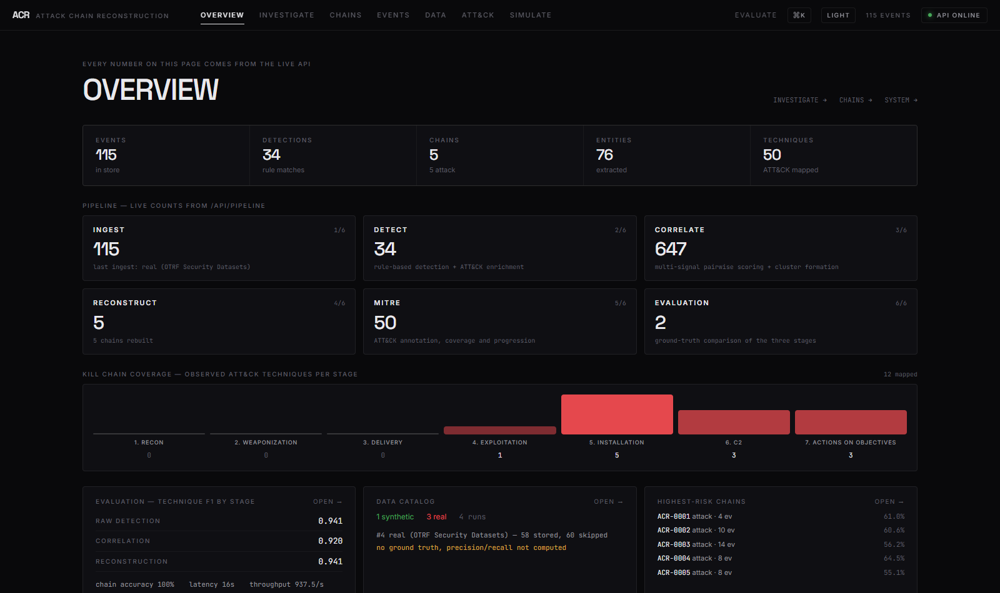
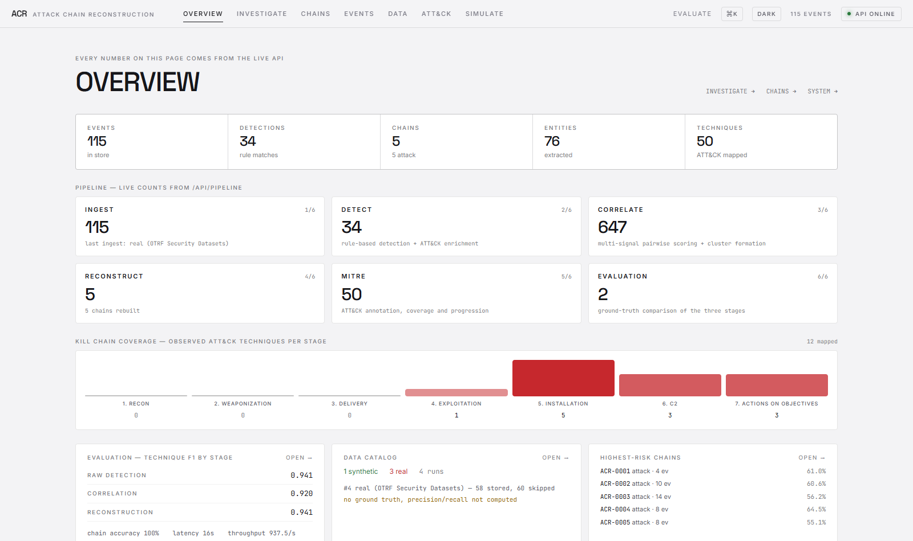
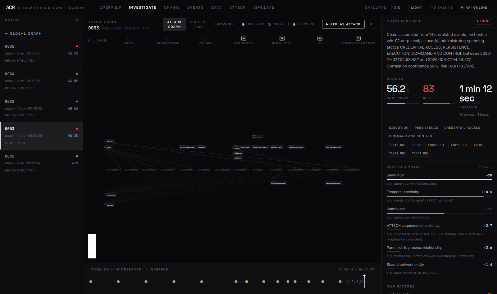
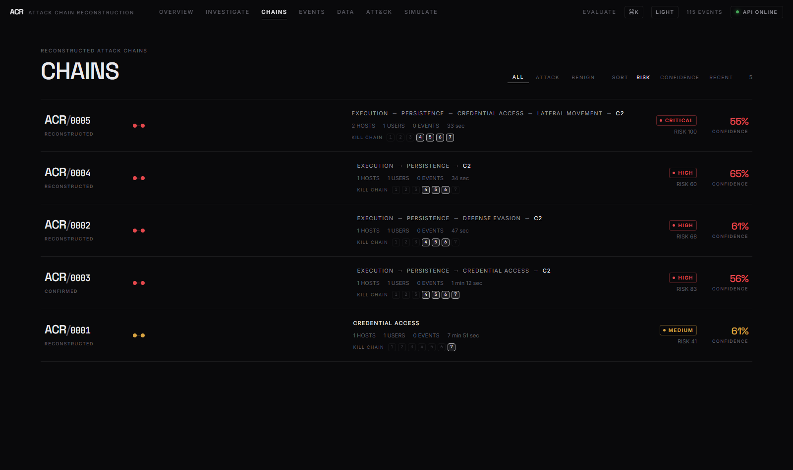
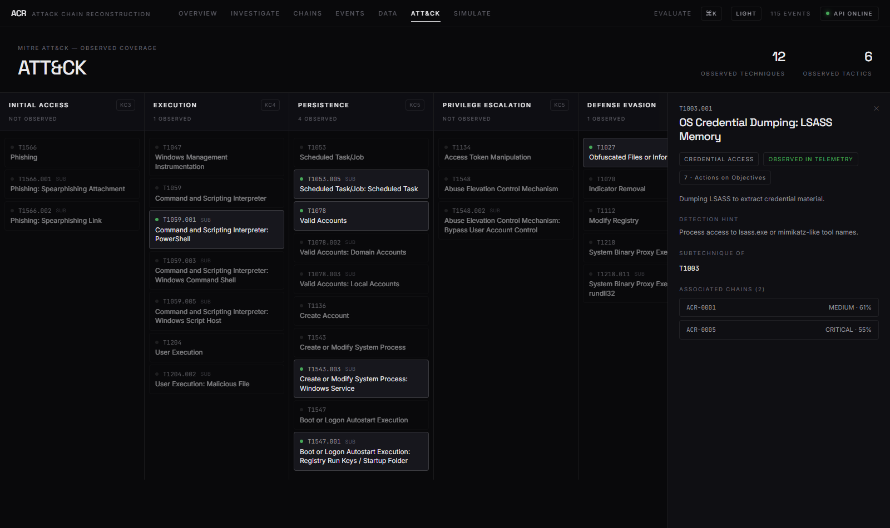
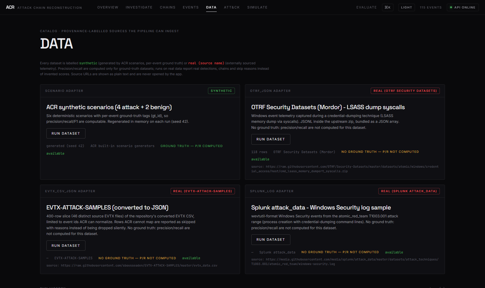
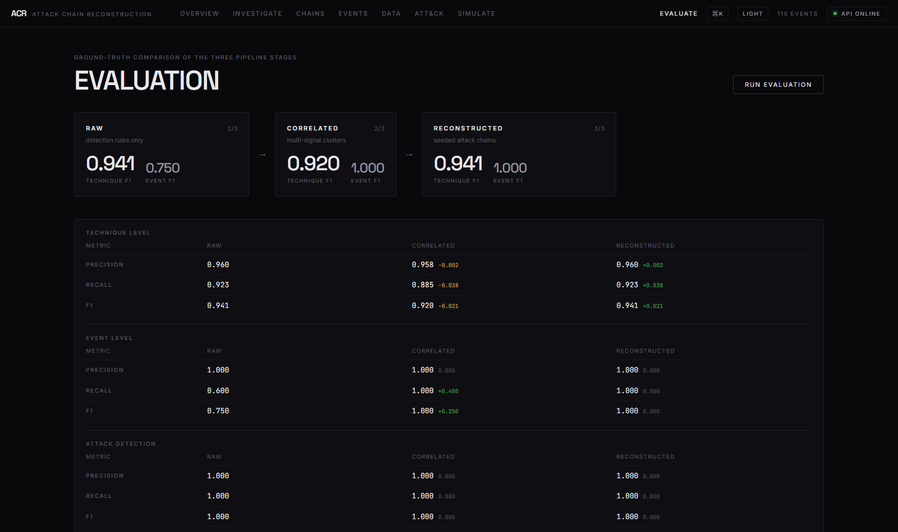
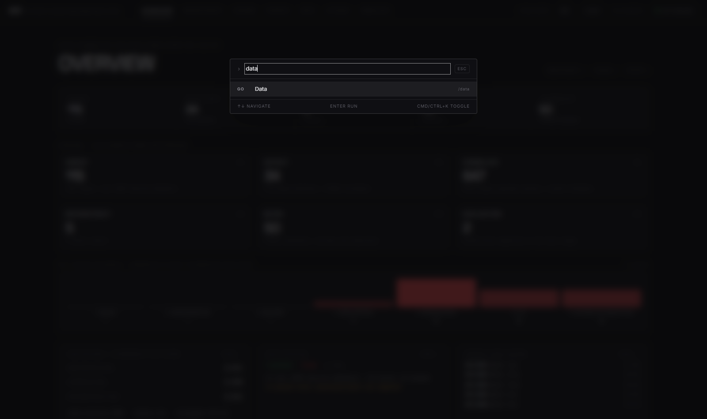

# ACR - Attack Chain Reconstruction Engine

ACR turns heterogeneous endpoint/network telemetry into reconstructed attack
chains: ingest -> normalize -> detect -> correlate -> reconstruct -> score ->
map to MITRE ATT&CK -> evaluate against synthetic ground truth. Everything is
rule-based and explainable - no fake ML, no hardcoded chains, no mock data.

## Screenshots

Headless-Chrome captures of the React frontend (full set in
[`docs/screenshots/`](docs/screenshots), walkthrough in
[`docs/demo.md`](docs/demo.md)):

| | |
|---|---|
|  |  |
| **Overview** — live stats, pipeline provenance, kill-chain coverage | **Light theme** — same data, token-swapped |
|  |  |
| **Investigate** — attack graph, kill-chain bar, replay, analyst rail | **Chains** — list with per-chain kill-chain strips |
|  |  |
| **ATT&CK** — KC chips per tactic, technique detail | **Data** — dataset catalog, provenance labels, runs |
|  |  |
| **Evaluate** — 3-stage metrics vs ground truth | **Command palette** — Ctrl/Cmd+K |

More: [landing](docs/screenshots/landing.png) ·
[system](docs/screenshots/system.png)

## Pipeline

```
raw telemetry (JSON / CSV / scenarios)
  -> normalization      canonical schema + aliases + structured issues
  -> entities           hosts, users, IPs, domains, processes, files
  -> detection          17 rules (auth, process, network, registry, ...)
  -> enrichment         technique/tactic written back onto events
  -> correlation        multi-signal pairwise scoring -> clusters
  -> reconstruction     seeded chains + attack path + evidence
  -> scoring            confidence (signal reasons), risk (factors/levels)
  -> missing steps      inferred ATT&CK gaps (always flagged inferred=true)
  -> REST API           JSON contracts for the frontend
  -> evaluation         3-stage metrics vs scenario ground truth
```

Correlation weights (sum = 100): temporal 20, same host 20, same user 11,
network group 10 (src 4 + dst 4 + domain 2), process relationship 20,
shared file 4, attack progression 10, event dependency 5.
Pairs need >= 35 points, and "same machine + time" alone is never enough.
Chains only form around detections/technique seeds, so benign scenarios
produce zero chains (FPR 0).

## Quickstart

```bash
pip install -r requirements.txt

# demo data: 6 scenarios (4 attack + 2 benign) ingested, detected, reconstructed
python -m acr generate

# counts, evaluation vs ground truth
python -m acr status
python -m acr evaluate --out eval_report.json

# REST API (OpenAPI docs at /docs)
python -m acr serve --port 8000
```

Useful extras:

```bash
# export a scenario's raw telemetry for manual ingestion / upload testing
python -m acr export CRED-001 --format json   # -> data/raw/CRED-001.json
python -m acr export CRED-001 --format csv    # -> data/raw/CRED-001.csv
python -m acr ingest data/raw/CRED-001.json --reconstruct

# export the OpenAPI spec for frontend integration -> docs/openapi.json
python -m acr openapi
```

`python -m acr` must be run from the project root (`D:\OpenCode\acr`).
The SQLite database defaults to `data/acr.db` (override with `ACR_DB_URL`).
`export` and `openapi` do not touch the database.

## REST API (stable contracts)

| Method | Path | Purpose |
| --- | --- | --- |
| GET | `/api/health`, `/api/config`, `/api/stats`, `/api/pipeline` | status, config, counts, stage stats |
| POST | `/api/events` | ingest JSON records (`{"events": [...]}`) |
| POST | `/api/events/upload` | ingest a JSON/CSV file (multipart) |
| GET | `/api/events`, `/api/events/{id}` | filtered list / detail with detections + entities |
| GET | `/api/chains`, `/api/chains/{id}` | chain list / full detail |
| GET | `/api/chains/{id}/timeline?include_inferred=` | replay timeline |
| GET | `/api/chains/{id}/evidence` | observed vs inferred evidence |
| GET | `/api/chains/{id}/process-tree`, `/network`, `/graph` | investigation views |
| GET | `/api/investigation/{id}` | timeline + process tree + network + summary |
| POST | `/api/chains/{id}/feedback` \| `/confirm` \| `/dismiss` | analyst verdicts |
| GET | `/api/mitre/techniques`, `/tactics`, `/coverage` | ATT&CK catalog + coverage |
| GET | `/api/scenarios` | scenario catalog |
| POST | `/api/scenarios/generate` | generate + ingest + reconstruct (idempotent) |
| POST | `/api/scenarios/reset` | clear demo data |
| POST | `/api/evaluation/run` | run 3-stage evaluation (persisted) |
| GET | `/api/evaluation/runs`, `/runs/{id}`, `/stages` | history + stage comparison |
| GET | `/api/graphs`, `/api/graphs/{chain_id}` | whole-store / per-chain graph |

Chain JSON always carries `confidence` (score + contributing reasons), `risk`
(score + level + factors), `techniques`, `attack_path`, `evidence`,
`possible_missing_steps` (each `inferred: true`).

For frontend work: `docs/openapi.json` is the machine-readable spec
(32 paths, 55 schemas), regenerable with `python -m acr openapi`.
Checked-in sample telemetry lives in `data/raw/` (JSON + CSV, same events,
both round-trip through the loaders).

## Scenarios & evaluation

| id | benign | story |
| --- | --- | --- |
| `CRED-001` | no | brute force -> valid logon -> PowerShell download -> registry persistence -> C2 |
| `PHISH-001` | no | Office macro -> encoded PowerShell -> payload -> C2 |
| `LAT-001` | no | credential dump -> SMB/WinRM lateral movement -> service install -> remote exec |
| `PERS-001` | no | scheduled task / service / run-key persistence with WMI execution |
| `PS-BENIGN-001` | yes | ordinary admin PowerShell usage |
| `BENIGN-OFFICE-001` | yes | normal document and mail activity |

`python -m acr evaluate` (or `POST /api/evaluation/run`) scores three stages
separately: `raw_detection` (rules only), `correlation` (clusters),
`reconstruction` (final chains) - precision / recall / F1, false-positive
rate, detection latency and throughput per stage, plus per-scenario detail.

Current results (seed 42, all 6 scenarios, 53 events):

- technique F1: raw 0.94 / correlation 0.92 / reconstruction 0.94
- event F1: raw 0.75 -> correlation 1.0 -> reconstruction 1.0
  (correlation recovers the full chain beyond individually flagged events)
- attack detection: recall 1.0, false-positive rate 0.0 at every stage
- reconstruction: 4/4 chains correct (F1 1.0), mean detection latency 16 s

## Configuration

All tunables live in `backend/app/core/config.py`: time windows
(STRICT 30 s / NORMAL 120 s / BROAD 600 s with 1.0 / 0.8 / 0.5 decay),
weights, `min_edge_score` 35, absorb threshold 50, attack confidence/risk
thresholds, brute-force windows, upload limits. `GET /api/config` exposes the
effective values.

## Tests & lint

```bash
python -m pytest backend/tests -q
python -m ruff check .
```

77 tests cover normalization, JSON/CSV loaders, entity + relationship
extraction, detection rules, correlation scoring and edge guards, scoring
units (confidence / risk / missing-step inference), chain reconstruction vs
ground truth, the evaluation engine and every REST endpoint (temporary
SQLite per test).
